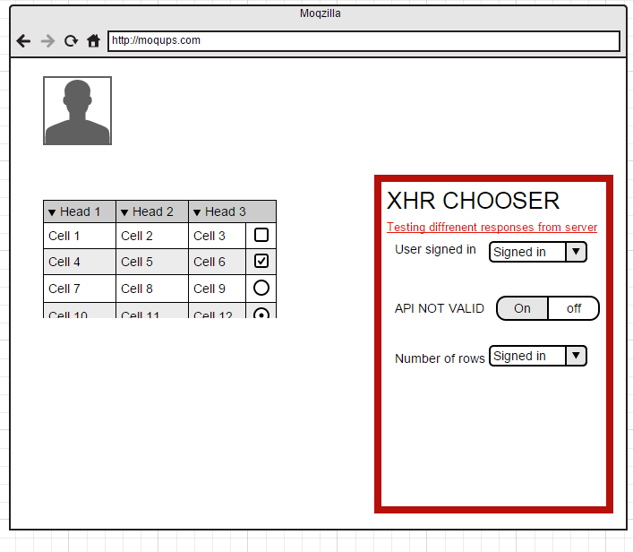

JS-Testing?

Goal
----

I am searching for a tool that will help writing front-end before the
back-end for webapp.

Demo
----
http://aminag.github.io/javascript-xhr-mock-chooser/tests.host.html

The problem
-----------

The front-end doing lot of request to the back-end (For example: sign
in/ sign up/ loading table data/ more). And I want to make usuability
test before writing the back-end.

Current solutions
-----------------

Use a mock-up library for JS. As simon, jasmine, Karma, qUnit and
others. Focus on mocking XHR request.

The problem With current solutions
----------------------------------

The problem with thoses solutions,

1.  they are focused on automatic testing after the front-end completed.
    And runing automatic tests.

2.  I want to show and fell different sceniraos.

3.  For example:

How the front-end will respond when password not valid,

Or how the front-end will respond when the server fall down.

Or how the front-end paginate lot of data when there are too many data
for a table

end-user embed
--------------

&lt;script src=xhrMockChooser.json &gt;&lt;/script&gt;

&lt;script&gt;

xhrMochShooer.loadSettings('settings.json')

xhrMochChooser.init();

&lt;/script&gt;

Load the chooser:
-----------------

The end-user open the chooser by pressing XHR.

Choose UI
---------

Settings JSON
-------------

\[

> {

name: 'user dialog test',

> request:'/user/me'
>
> method:'post'
>
> response:\[
>
> {
>
> name:'logged in'
>
> response: {user\_id:5333,name:'micha'}
>
> },
>
> {
>
> name:'logged out'
>
> response: {user\_id:0}
>
> },
>
> },
>
> {

name: 'api not valid',

> request:'/api/give me cookies'
>
> method:'post'
>
> response:404
>
> \]

\]

Ase you see there are two arrays:

1.  Array of requests

2.  Array of posibile responses.

Answer\_obj

Posibile valud for response:

**Number** – return just an status\_code (for example: 404 - not found,
510 – page not found, etc'

**String** – return a regular body

**JSON** – return a APPLICATION/JSON data.

**ARRAY –** Array mean that there are some different responses to test.

Mobile / Tablet
---------------

> INn mobile we open te chooser by adding hash tag "\#xhr" to the
> Address.

Save data
---------

> All the data saved in cookies. So next time same user open browser he
> get back to same data. (If the XHR is openend, so next time it will be
> opened)

User specification
------------------

> Each "test" have turn on/off switch. When it is turned off REAL xhr
> requet to the back-end happen.
>
> When the are multi options for the response (response is an array).
> The end user will see select box instead of the switch. In the select
> box on of the options will be "off".
>
> Time to develop:
>
> Hours
>
> Start
>
> 27/-8 – 15:17
